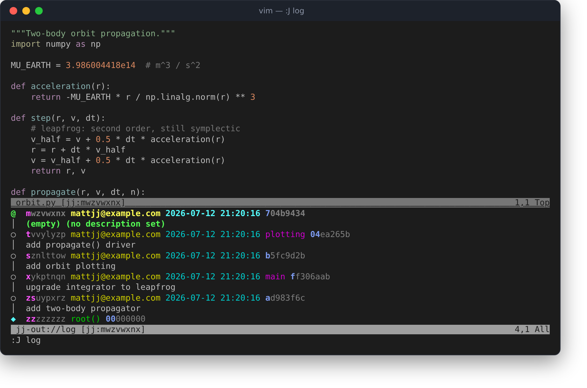
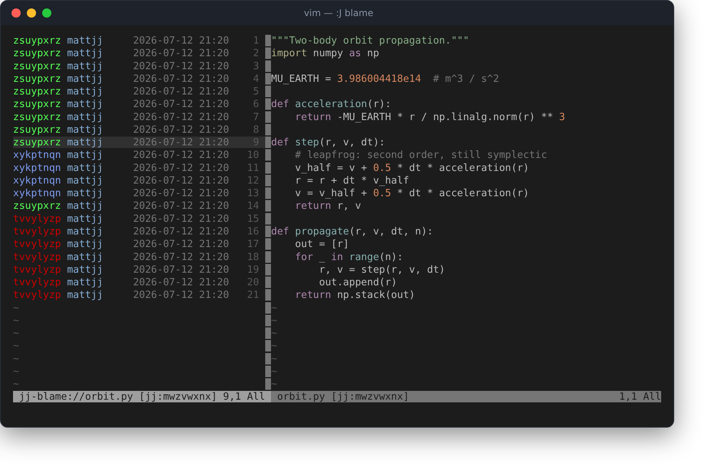
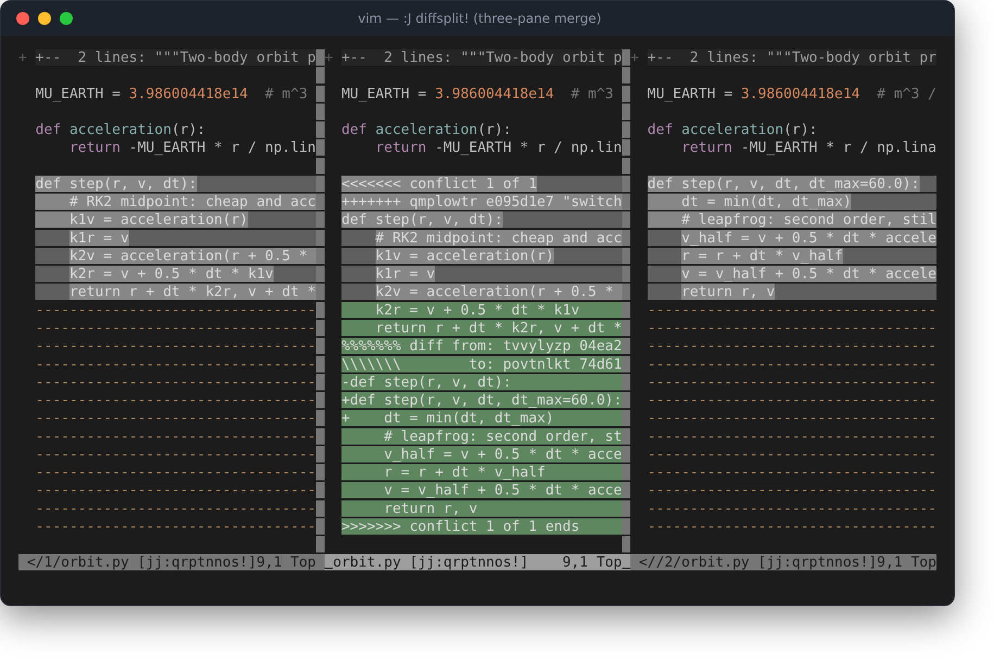

# vim-jj

A small Vim plugin for the [Jujutsu](https://github.com/jj-vcs/jj) version
control system (`jj`), in the spirit of tpope's
[fugitive.vim](https://github.com/tpope/vim-fugitive).

It deliberately covers a *narrow* slice of fugitive's surface — blame,
diff, and object browsing — rather than trying to be a full port.

A design goal is that everything works in **any jj workspace**, including
secondary workspaces created with `jj workspace add`, where there is no
`.git` directory anywhere above your files. Workspace discovery only ever
looks for a `.jj` directory, and every `jj` invocation passes an explicit
`--repository` flag, so Vim's current directory never matters either.

## Screenshots

`:J log` — jj's colored graph rendered inside Vim with text properties,
bold unique-prefix change ids and all. Hit `<CR>` on a line to open that
commit:



`:J blame` — a scroll-bound annotation column, each change id in a stable
color:



`:J diffsplit!` — three-pane conflict resolution: side 1, the working
file with markers, side 2. `d2o`/`d3o` pull a region from either side;
edit, `:w`, done:



## Commands

fugitive | vim-jj | what it does
--- | --- | ---
`:Git blame` | `:J blame` | annotations for the current file in a scroll-bound left split (`q` to close, `<CR>` to open the commit that introduced a line, `o` for a split)
`:Git diff` | `:J diff [args]` | `jj diff --git` output in a scratch window with diff highlighting (`:J diff -r @-`, `:J diff --stat`, ...)
`:Gdiffsplit` | `:J diffsplit [revset]` | vimdiff the current file against the same file at `revset` (default: the parent of the buffer's revision, i.e. `@-` for a working-copy file)
`:Gdiffsplit!` | `:J diffsplit!` | three-pane merge view for a conflicted file: side 1 \| working file \| side 2, all in diff mode, with fugitive's `d2o`/`d3o` to pull a conflict region from the left/right pane and `dp` in a side pane to push; resolve, `:w`, done (jj has no "mark resolved" step)
`:Gedit` | `:J edit {object}` | open a read-only buffer for a jj object: `:J edit @-` (the current file as of `@-`), `:J edit main:src/foo.py` (another file at a revision); commit views (`jj show`-style) come from `:J show @-` or `<CR>` in log/blame
`:Gsplit` etc. | `:J split` / `:J vsplit` / `:J tabedit` / `:J pedit` | same, in a split/tab/preview window
`:GBrowse` | `:J browse` | yank a permalink to the current line on GitHub, pinned at a commit (`:'<,'>J browse` for a line range, `:J browse!` to also open it); derived from the repo's git remote, pinning the nearest pushed ancestor of `@` (or the exact commit in an object buffer)
_(no equivalent)_ | `:J pr` | yank/open the pull request that introduced the current line — resolved from squash/merge subject markers, then GitHub's API (`$GITHUB_TOKEN` honored; offline merge-heuristic fallback), then the commit page; works in file buffers, the blame pane, and commit views
`:Git <anything>` | `:J <anything>` | any other subcommand is passed through to jj and its output shown in a scratch window: `:J`, (= `jj status`), `:J log`, `:J new`, `:J describe -m msg`, `:J op log`, ...

## Pretty things

- **jj's colors, in Vim.** Output windows run jj with `--color=always` and
  re-render the ANSI codes as Vim text properties (extmarks on Neovim), so
  `:J log` looks exactly like the terminal: the colored graph, bookmarks,
  timestamps, and jj's bold shortest-unique-prefix change ids — including
  whatever custom colors you've set in jj's own config. `let g:jj_color = 0`
  for plain text.
- **Navigable log/status.** In any output window, `<CR>` opens the commit
  whose change id is on the current line (`o` for a split, `O` for a tab,
  `R` refreshes, `q` closes), and `gf` opens the file you came from as of
  that commit. Same in `:J blame`: `<CR>` for the commit, `gf` for the
  file back then. `:J log`, hit `<CR>` on a commit, `]c` through its
  hunks.
- **Colorful blame.** Each change id in `:J blame` gets a stable rotating
  color, fugitive-style.
- **Statusline.** `set statusline+=%{jj#Statusline()}` shows e.g.
  `[jj:tuxqvyvp+]` — the working-copy change id, `!` if conflicted, `+` if
  non-empty. Cached and lock-free (`--ignore-working-copy`).
- **Completion.** `:J edit <Tab>` completes bookmarks and common revsets;
  the first argument completes subcommand names.

Like fugitive, blame/diffsplit/edit compose: from a buffer showing a file
at an old revision, `:J blame` annotates as of that revision, `:J
diffsplit` diffs against that revision's parent, and `:J edit` (no
argument) takes you back to the working copy.

`:JJ` is an alias for `:J` in case another plugin owns `:J`.

`]c` and `[c` behave as in fugitive: in patch-displaying buffers
(`:J diff`, `:J show`, commit buffers) they jump between `@@` hunk
headers; in diff-mode views (`:J diffsplit`, the three-pane merge) Vim's
native jump-between-changes applies.

## Installation

Any plugin manager works, e.g. with vim-plug:

```vim
Plug 'mattjj/vim-jj'
```

or with Vim 8 packages:

```sh
git clone https://github.com/mattjj/vim-jj \
  ~/.vim/pack/plugins/start/vim-jj
```

Requires Vim 8.2+ (or Neovim) and a reasonably recent `jj` (`:J blame`
uses `jj file annotate -T`; tested with jj 0.43).

## Configuration

```vim
let g:jj_executable = 'jj'      " name/path of the jj binary
let g:jj_blame_template = '...' " jj template for blame annotation lines
```

## Caveats

- Commands that want to spawn an editor will fail; pass `-m` style flags
  instead (`:J describe -m message`).
- `:J blame` requires the buffer to be written first (jj snapshots the
  working copy when it runs, so the file on disk is what gets annotated).
- `jj file annotate` can be slow on files with deep history (it's much
  younger than `git blame`). vim-jj compensates: blame runs as an async
  job (the pane opens instantly and fills in), and results are cached per
  commit — in memory and on disk under `.jj/vim-jj/cache/` (never tracked,
  no `.gitignore` needed) — so re-blaming an unchanged file is instant,
  even across Vim restarts.
- No `:Gwrite`/staging analogue — jj doesn't have an index, so a good
  chunk of fugitive has no jj counterpart anyway.

## Credit

The interface and much of the implementation approach (object buffers
populated by a `BufReadCmd`, the scroll-bound blame window) are borrowed
with gratitude from [fugitive.vim](https://github.com/tpope/vim-fugitive).
